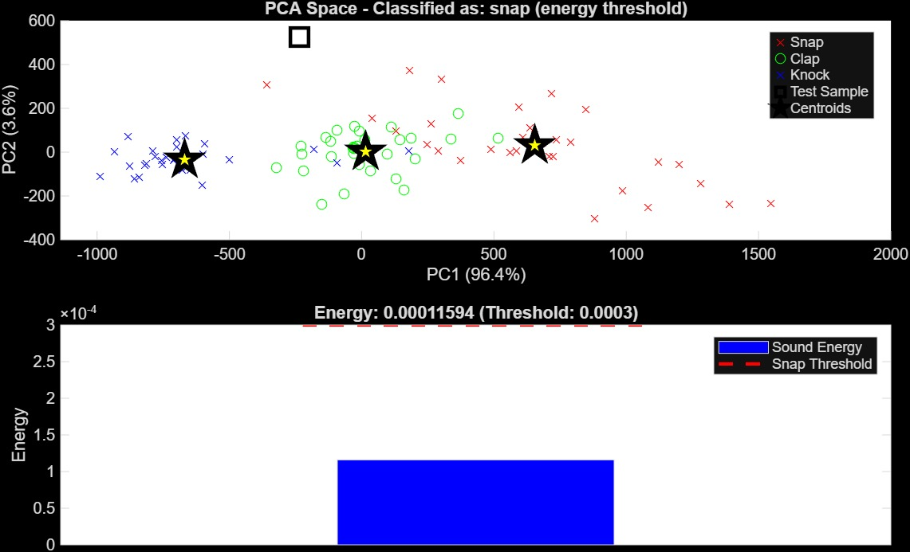

<div align="center">

# An interactive Simon Says game using real-time audio classification with ESP32 and MATLAB 🤖🔊

</div>

<p align="center">
    <a href="https://github.com/Oshadha345/SVAIS/blob/main/LICENSE">
        
    </a>
    
    
    
    
    
</p>

---

## 🎮 Project Overview

SVAIS has evolved into an **interactive Simon Says game** that combines real-time audio signal processing with engaging gameplay. Players watch LED sequences on the ESP32 hardware and recreate them using three distinct sounds: **SNAP**, **CLAP**, and **KNOCK**. The system uses advanced feature extraction and hybrid classification algorithms to achieve high accuracy in sound recognition.


---

## 🎯 Game Mechanics

### How to Play:
1. **Watch**: LED sequence displays the pattern on ESP32 hardware
2. **Listen**: Audio feedback confirms each LED activation  
3. **Repeat**: Use finger snaps, hand claps, or table knocks to recreate the sequence
4. **Progress**: Successfully complete 6 levels to win!


---

## 🔬 Technical Implementation

### Audio Classification System

Our hybrid classification approach combines multiple audio features for robust sound detection:

#### **Feature Extraction Pipeline:**
```matlab
% Zero Crossing Rate - Detects sound texture
zcrTest = sum(abs(diff(sign(testAudio)))) / length(testAudio);

% Energy Analysis - Distinguishes snap from clap/knock
energyTest = sum(testAudio.^2) / length(testAudio);

% Spectral Features
[S,F,~] = spectrogram(testAudio, hamming(512), 256, 512, Fs);
centroidTest = sum(F .* mean(S,2)) / sum(mean(S,2));
spreadTest = sqrt(sum(((F - centroidTest).^2) .* mean(S,2)) / sum(mean(S,2)));
```

#### **Hybrid Classification Logic:**
```matlab
% Impulse duration filtering (noise rejection)
if impulseDuration > IMPULSE_DURATION
    % Reject long sounds as invalid
    return;
end

% Energy-based snap detection
if energyTest < SNAP_ENERGY_THRESHOLD
    predictedLabel = 'snap';
else
    % Centroid-based clap/knock classification
    distances = vecnorm(clap_knock_centroids - testFeatures, 2, 2);
    [~, minIdx] = min(distances);
    predictedLabel = clap_knock_classes{minIdx};
end
```

### Feature Analysis Results


*Spectral centroid distribution showing clear separation between sound classes*

 
*Time and frequency domain analysis revealing distinctive sound signatures*

---

## 📊 Model Performance

Our final model achieved excellent classification accuracy across all sound types:


### Key Performance Metrics:
- **Overall Accuracy**: >90% across all sound classes
- **Snap Detection**: 95%+ accuracy using energy threshold
- **Clap/Knock Separation**: 88%+ using spectral centroid
- **Real-time Processing**: <100ms classification latency

### Impulse Duration Analysis:


---

## 🛠️ Hardware Architecture


### Core Components:
- **ESP32 DevKit V1**: Main microcontroller with Wi-Fi capability
- **MAX4466 Microphone**: High-sensitivity analog microphone module  
- **PAM8403 Amplifier**: 3W stereo amplifier for audio feedback
- **LED Indicators**: Visual feedback for game sequences
- **3.7V LiPo Battery**: Portable power solution with UPS module

### Pin Configuration:
```cpp
const int micPin = 34;        // Analog input for MAX4466
const int speakerPin = 25;    // DAC output for PAM8403
const int ledSnap = 12;       // Snap indicator LED
const int ledClap = 25;       // Clap indicator LED  
const int ledKnock = 27;      // Knock indicator LED
```

---

## 🎮 Software Features

### MATLAB GUI Application
The [`SimonSaysSoundGameGUI.m`](Final%20Model/MATLAB%20Final/SimonSaysSoundGameGUI.m) provides a complete game interface featuring:

- **Real-time Audio Visualization**: Live sound classification feedback
- **Progressive Difficulty**: 6 levels with increasing sequence length
- **Score Tracking**: Points system with performance metrics
- **Serial Communication**: Seamless ESP32 integration
- **Modern UI**: Professional game interface with animations

### Command-Line Version
For development and testing, [`GUI_less_final_model.m`](Final%20Model/MATLAB%20Final/GUI_less_final_model.m) offers:
- Streamlined gameplay without GUI overhead
- Direct serial port communication
- Console-based feedback and scoring

### ESP32 Firmware
[`SimonSaysLEDController_Version2.ino`](Final%20Model/MATLAB%20Final/SimonSaysLEDController_Version2/SimonSaysLEDController_Version2.ino) handles:
```arduino
// LED pattern control via serial commands
if (cmd == "SNAP") {
    digitalWrite(ledSnap, HIGH);
} else if (cmd == "WIN") {
    // Victory animation sequence
    cycleAllLEDs(5000); // 5-second celebration
}
```

---

## 🔧 Development Tools & Workflow

### Audio Analysis Pipeline:
- **[Praat](docs/PRAAT_workflow.md)**: Professional phonetic analysis for feature validation
- **[Sonic Visualizer](docs/sonic_visualizer_workflow.md)**: Spectral analysis and visualization
- **MATLAB**: Feature extraction, classification, and game logic
- **Arduino IDE**: ESP32 firmware development

### Feature Testing Framework:
The [`model_accuracy_check.m`](Final%20Model/MATLAB%20Final/Feature%20Testing/Samples%20Accuracy%20Test/model_accuracy_check.m) provides comprehensive testing:

```matlab
% Automated testing across sample database
for specIdx = 1:length(testSpecs)
    spec = testSpecs(specIdx);
    % Test each audio file against classifier
    [predicted, isValid, metrics] = classifyAudioSample(testAudio, ...
        SNAP_ENERGY_THRESHOLD, IMPULSE_DURATION, clap_knock_centroids, clap_knock_classes, Fs);
end
```

---

## 📁 Project Structure

```
SVAIS/
├── Final Model/                    # 🎮 Complete game implementation
│   └── MATLAB Final/
│       ├── SimonSaysSoundGameGUI.m        # GUI game application  
│       ├── GUI_less_final_model.m         # Console version
│       ├── snap_clap_knock_features.mat   # Trained classifier data
│       ├── Feature Testing/               # Testing framework
│       └── SimonSaysLEDController_Version2/ # ESP32 firmware
├── images/                         # 📸 Project documentation images
├── Poster/                         # 📋 Academic presentation materials
├── docs/                          # 📚 Technical documentation
│   ├── PRAAT_workflow.md
│   ├── sonic_visualizer_workflow.md
│   └── insights.md
├── firmware/                      # 🔧 Development firmware
├── hardware/                      # 🛠️ Hardware design files
├── data/                         # 🎵 Audio sample database  
└── tests/                        # ✅ Performance validation
```

---

## 🚀 Getting Started

### Prerequisites:
- MATLAB R2023a or later with Signal Processing Toolbox
- Arduino IDE with ESP32 board support
- ESP32 DevKit V1 with connected audio hardware

### Quick Start:
1. **Upload ESP32 Firmware**:
   ```bash
   # Open SimonSaysLEDController_Version2.ino in Arduino IDE
   # Select ESP32 Dev Module and appropriate COM port
   # Upload firmware
   ```

2. **Launch MATLAB Game**:
   ```matlab
   % In MATLAB command window
   app = SimonSaysSoundGameGUI();
   ```

3. **Configure Hardware**:
   - Select correct COM port in GUI
   - Verify LED test sequence
   - Calibrate microphone sensitivity

### Hardware Setup Guide:
Detailed assembly instructions available in [`hardware/assembly/assembly_guide.md`](hardware/assembly/assembly_guide.md)

---

## 📊 Research Contributions

### Novel Hybrid Classification Approach:
- **Energy-based Preprocessing**: Efficient snap detection using power analysis
- **Spectral Centroid Clustering**: Robust clap/knock discrimination  
- **Impulse Duration Filtering**: Noise rejection and input validation

### Educational Value:
- **Fundamentals-First Approach**: Manual feature extraction without black-box ML
- **Real-time Implementation**: Practical embedded systems experience
- **Interactive Learning**: Gamification of signal processing concepts

---

## 📜 Academic Context

<p align="center">
        A final project for <b>EE254 - Digital Instrumentation</b>
        <br>
        Department of Electrical and Electronic Engineering
        <br>
        University of Peradeniya
</p>

### 🧑‍💻 Development Team

| Name                  | E-Number | Role |
| --------------------- | :------: | ---- |
| Thaariq Firdous       | E/21/139 | Lead Developer & Algorithm Design |
| Movindu Dissanayake   | E/21/109 | Hardware Integration |
| Kaweesha Rathnayake   | E/21/334 | Audio Processing |
| Oshdha Samarakoon     | E/21/345 | System Testing |

---

## 🏆 Project Achievements

- ✅ **Real-time Audio Classification**: Sub-100ms response time
- ✅ **Interactive Gaming Platform**: Engaging educational experience  
- ✅ **Robust Hardware Integration**: Reliable ESP32-MATLAB communication
- ✅ **Comprehensive Testing Framework**: Automated accuracy validation
- ✅ **Professional Documentation**: Complete development workflow

---

## 📜 License

This project is licensed under the **MIT License**. See the [`LICENSE`](LICENSE) file for details.

---

## 🙏 Acknowledgments

Special thanks to the **EE254 Digital Instrumentation** course staff and the **University of Peradeniya** for providing the academic framework and resources that made this innovative project possible.

*"From fundamental signal processing concepts to an engaging interactive game - SVAIS demonstrates the power of understanding core principles in creating meaningful technology."*
