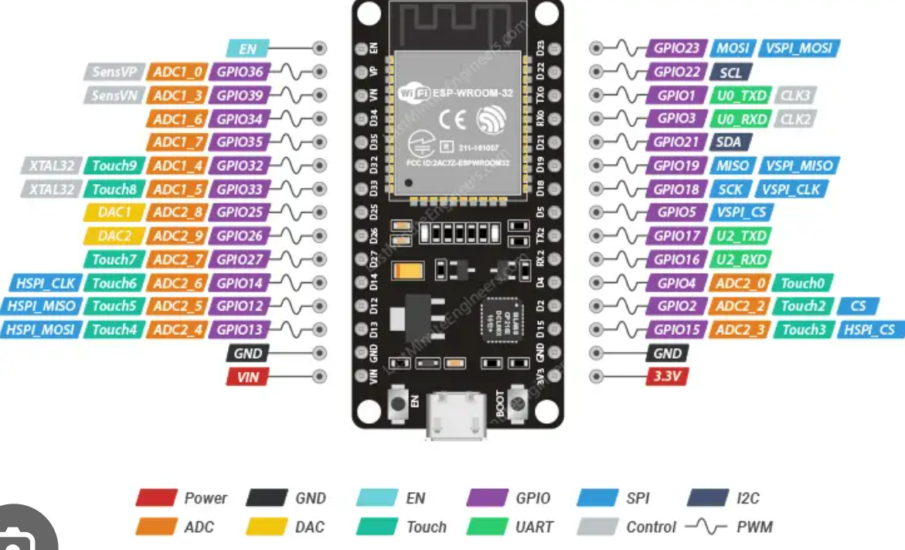

# README for SVAIS Firmware Development

## Overview
This directory contains the firmware source code and related files for the Smart Voice-based Acoustic Intelligent System (SVAIS) project. The firmware is designed to run on the ESP32 microcontroller and interfaces with various hardware components, including microphones, speakers, and amplifiers.

## Directory Structure
- **src/**: Contains the main source code files for the firmware.
  - `main.cpp`: The entry point for the firmware application.
  
- **lib/**: This directory is reserved for any libraries that may be used in the project. Additional libraries can be added here as needed.

- **platformio.ini**: Configuration file for PlatformIO, which defines the project environment, dependencies, and build settings.

## Getting Started
To get started with the firmware development, follow these steps:

1. **Clone the Repository**: 
   Clone the SVAIS repository to your local machine using Git.

   ```
   git clone https://github.com/yourusername/SVAIS.git
   ```

2. **Install PlatformIO**: 
   Ensure you have PlatformIO installed. You can install it as a plugin in your preferred code editor or use it via the command line.

3. **Open the Project**: 
   Open the `SVAIS` directory in your code editor with PlatformIO support.

4. **Build the Project**: 
   Use the PlatformIO build command to compile the firmware.

   ```
   pio run
   ```

5. **Upload to ESP32**: 
   Connect your ESP32 board to your computer and upload the firmware using the following command:

   ```
   pio run --target upload
   ```

## Development Guidelines
- Follow coding standards and best practices for embedded systems programming.
- Comment your code thoroughly to ensure clarity and maintainability.
- Test each module independently before integrating into the main application.
- Use version control effectively to manage changes and collaborate with team members.

## Documentation
Refer to the `docs/insights.md` file for insights and logs related to the project iterations and findings.

## Future Work
- Implement additional features based on the insights gathered from hardware testing.
- Optimize the firmware for performance and memory usage.
- Explore integration with machine learning models for enhanced sound detection capabilities.

## ESP32 pin diagram

